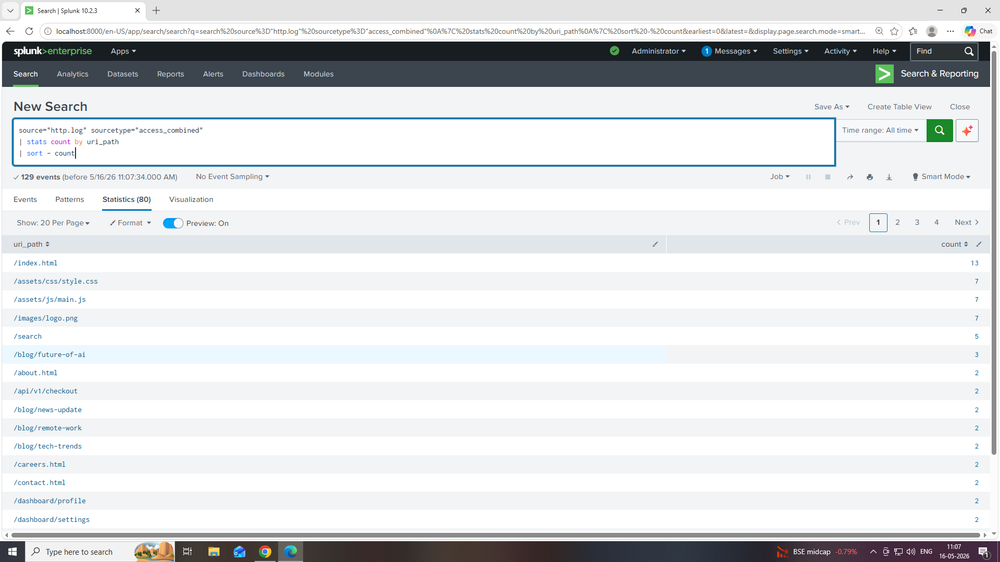
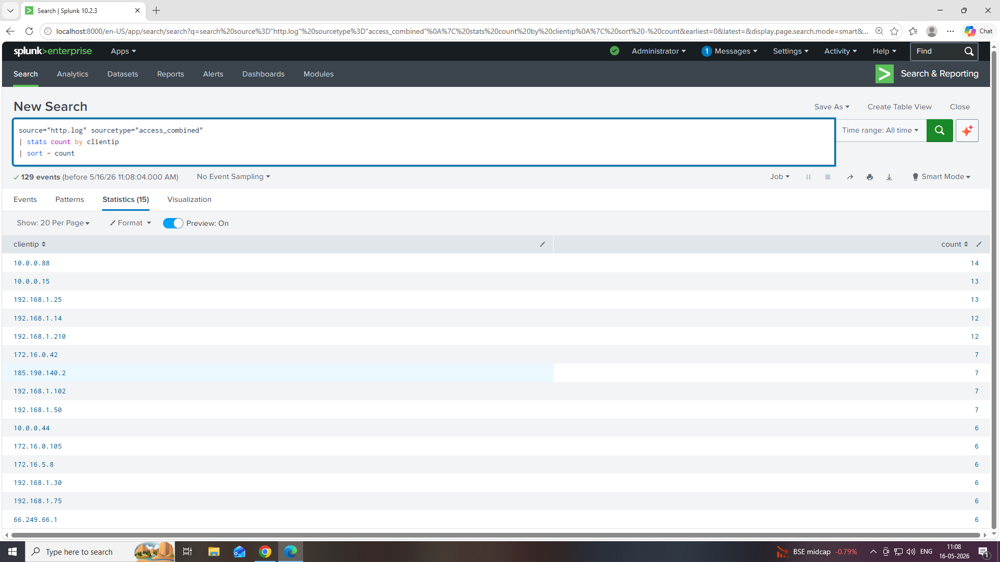
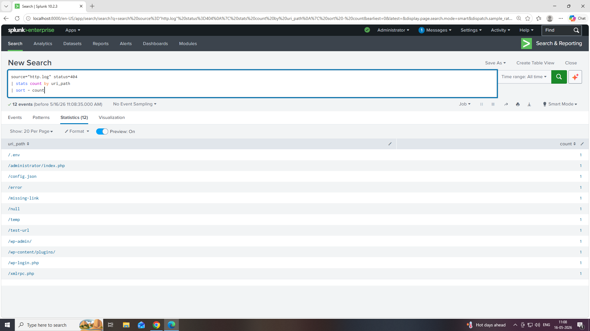
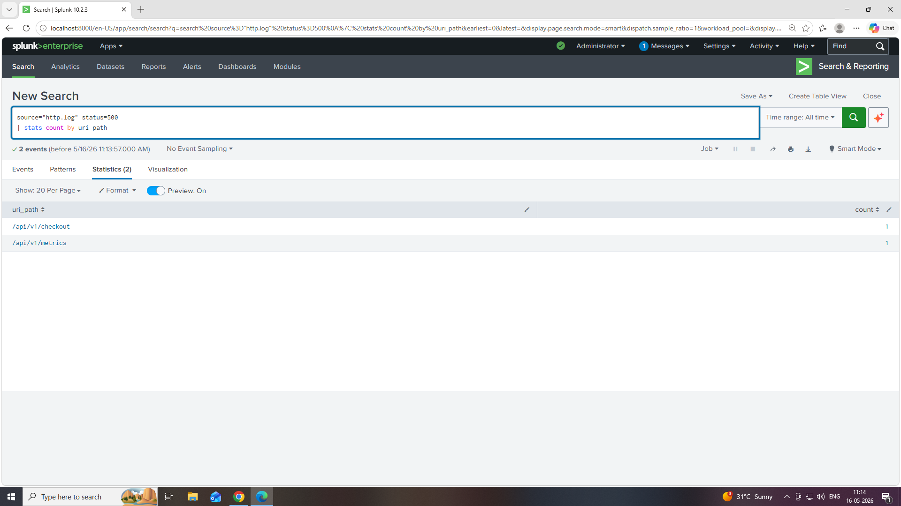
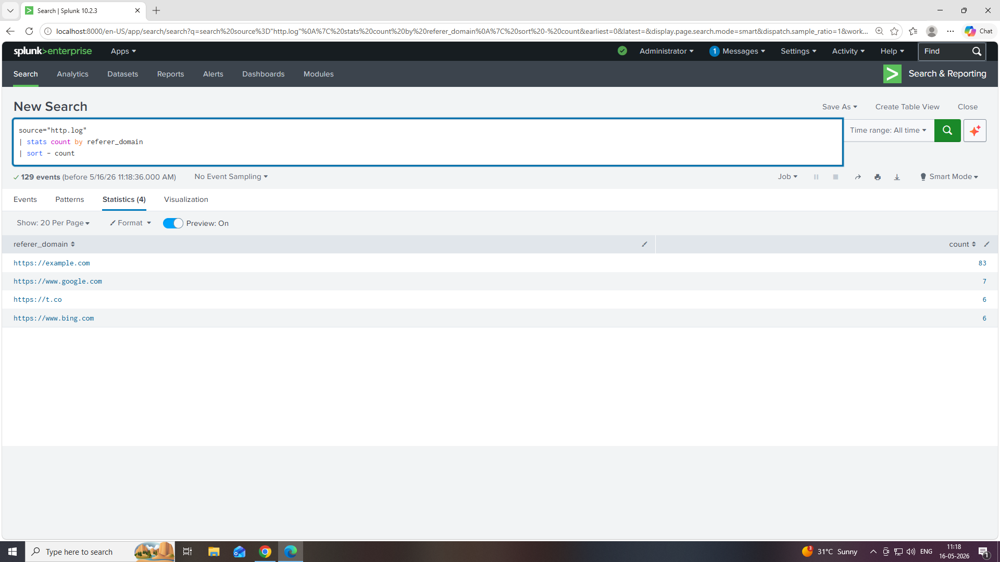
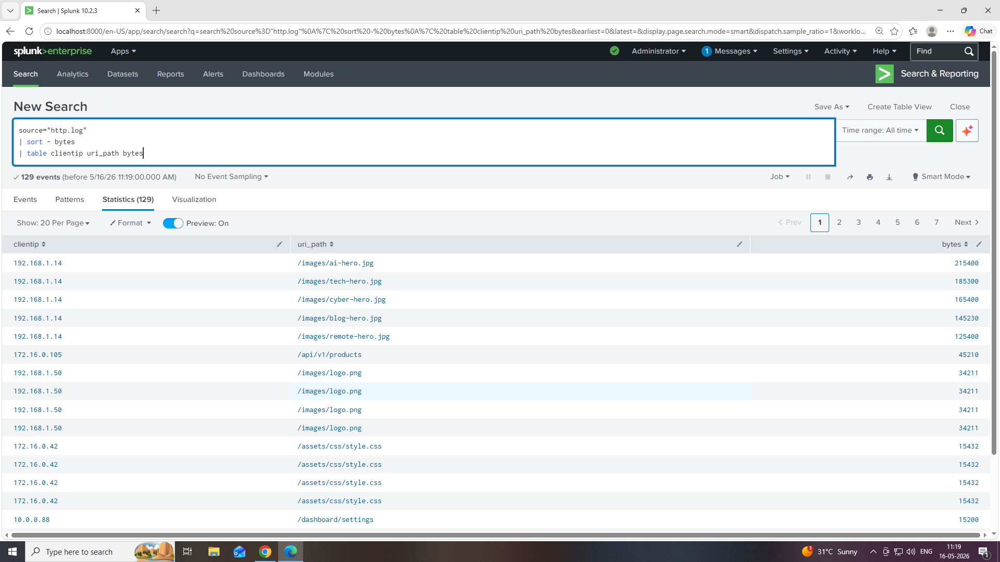
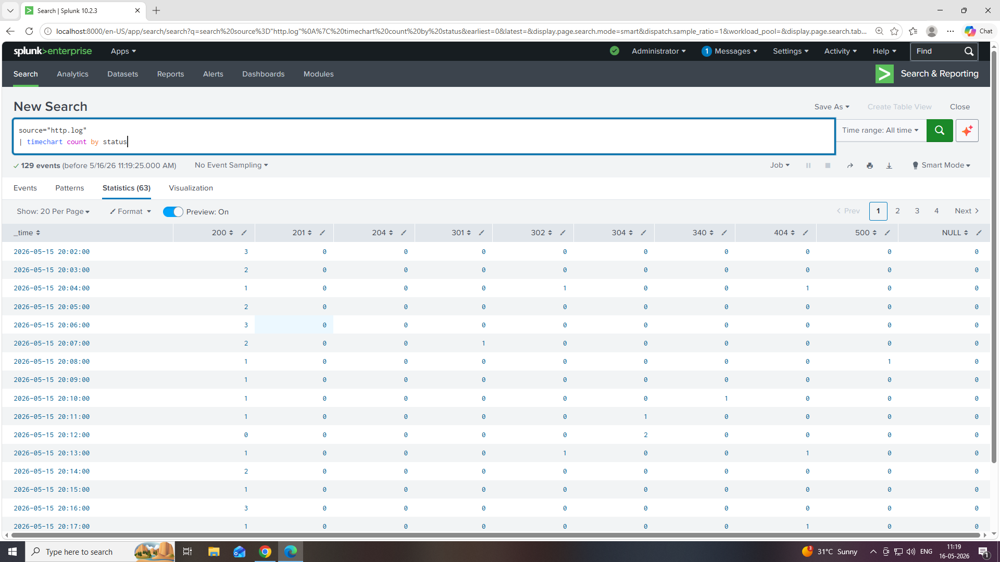

# 🔍 Splunk SIEM HTTP Log Analysis Project

## 📌 Project Overview

This project demonstrates practical log analysis and threat hunting using **Splunk Enterprise** on HTTP access logs.

The investigation includes:

- Web traffic monitoring
- HTTP status code analysis
- Suspicious URL detection
- Client IP analysis
- Request method monitoring
- Referrer analysis
- Bandwidth usage investigation
- Server error identification

This project simulates real-world SOC analyst activities using SPL (Search Processing Language).

---

# 🛠️ Environment Details

| Component | Value |
|---|---|
| SIEM Tool | Splunk Enterprise 10.2.3 |
| Log Source | `http.log` |
| Sourcetype | `access_combined` |
| Analysis Type | HTTP Access Log Analysis |
| Platform | Splunk SPL |

---

# 🎯 Project Objectives

- Analyze HTTP traffic logs
- Detect suspicious activity
- Monitor web server behavior
- Investigate HTTP errors
- Identify active clients
- Perform basic threat hunting
- Visualize status code activity

---

# 📂 Important Fields Extracted

| Field | Description |
|---|---|
| `clientip` | Source IP address |
| `uri_path` | Requested URL |
| `method` | HTTP method |
| `status` | HTTP response code |
| `referer_domain` | Traffic source |
| `bytes` | Response size |
| `useragent` | Browser or tool used |

---

# 🔎 Query 1 — Top Requested URLs

## SPL Query

```spl
source="http.log" sourcetype="access_combined"
| stats count by uri_path
| sort - count
```

## 📊 Findings

Most accessed resources:

- `/index.html`
- `/assets/css/style.css`
- `/assets/js/main.js`
- `/images/logo.png`
- `/api/v1/checkout`

### ✅ Purpose

Helps identify:

- High traffic pages
- Frequently accessed assets
- Popular API endpoints

  ## 🔹 Top Requested URLs



---

# 🌐 Query 2 — Most Active Client IPs

## SPL Query

```spl
source="http.log" sourcetype="access_combined"
| stats count by clientip
| sort - count
```

## 📊 Findings

Top active IPs:

- `10.0.0.88`
- `192.168.1.14`
- `172.16.0.42`
- `185.190.140.2`

### ✅ Purpose

Used for:

- Traffic source analysis
- Detecting scanners
- Identifying suspicious activity

  ## 🔹 Most Active Client IPs



---

# 🚨 Query 3 — HTTP 404 Error Analysis

## SPL Query

```spl
source="http.log" status=404
| stats count by uri_path
| sort - count
```

## 📊 Findings

Suspicious requests detected:

- `/.env`
- `/wp-admin/`
- `/wp-login.php`
- `/xmlrpc.php`
- `/administrator/index.php`

### ⚠️ Security Observation

These requests may indicate:

- Vulnerability scanning
- WordPress enumeration
- Automated reconnaissance attacks

  ## 🔹 HTTP 404 Error Analysis



---

# 🔥 Query 4 — HTTP 500 Error Analysis

## SPL Query

```spl
source="http.log" status=500
| stats count by uri_path
```

## 📊 Findings

500 Internal Server Errors found on:

- `/api/v1/checkout`
- `/api/v1/metrics`

### ⚠️ Possible Causes

- Backend failure
- API issues
- Database errors
- Misconfigured services

  ## 🔹 HTTP 500 Error Analysis



---

# 📡 Query 5 — HTTP Method Analysis

## SPL Query

```spl
source="http.log"
| stats count by method
```

## 📊 Findings

Methods observed:

- GET
- POST
- DELETE

### ⚠️ Security Observation

DELETE requests should be investigated because they may indicate:

- Unauthorized API usage
- Malicious activity
- Misconfigured applications

  ## 🔹 HTTP Method Analysis


---

# 🌍 Query 6 — Referrer Domain Analysis

## SPL Query

```spl
source="http.log"
| stats count by referer_domain
| sort - count
```

## 📊 Findings

Traffic sources included:

- Google
- Bing
- External referral domains

### ✅ Purpose

Useful for:

- Understanding traffic origin
- Search engine analysis
- Referral tracking

  ## 🔹 Referrer Domain Analysis



---

# 📦 Query 7 — High Bandwidth Requests

## SPL Query

```spl
source="http.log"
| sort - bytes
| table clientip uri_path bytes
```

## 📊 Findings

High bandwidth resources:

- `/images/ai-hero.jpg`
- `/images/blog-hero.jpg`
- `/api/v1/products`

### ✅ Purpose

Helps identify:

- Large downloads
- Heavy API responses
- Possible bandwidth abuse

  ## 🔹 High Bandwidth Requests



---

# 📈 Query 8 — HTTP Status Timeline

## SPL Query

```spl
source="http.log"
| timechart count by status
```

## 📊 Findings

Observed status codes:

- 200 → Success
- 301 / 302 → Redirects
- 304 → Cached responses
- 404 → Missing resources

### ✅ Purpose

Used for:

- Monitoring server health
- Detecting spikes in errors
- Tracking application stability

  ## 🔹 HTTP Status Timeline



---

# 🛡️ Security Findings Summary

| Observation | Risk |
|---|---|
| Requests to `/.env` | Sensitive file probing |
| Requests to `/wp-admin/` | WordPress scanning |
| Multiple 404 errors | Enumeration attempts |
| DELETE requests | Suspicious API activity |
| HTTP 500 errors | Application instability |
| External IP activity | Possible reconnaissance |

---

# 🧠 Skills Demonstrated

- Splunk Enterprise
- SPL Query Writing
- SIEM Monitoring
- HTTP Log Analysis
- Threat Hunting
- Security Investigation
- Web Traffic Analysis
- Error Monitoring
- SOC Operations

---

# ✅ Conclusion

This project demonstrates how Splunk can be used for real-world HTTP log analysis and security monitoring.

The investigation successfully identified:

- Traffic patterns
- Client behavior
- Error conditions
- Suspicious requests
- Potential attack indicators

This project provides hands-on SOC analyst experience in:

- SIEM investigation
- Threat detection
- Log analysis
- Security monitoring
- Splunk SPL usage

---

# 👨‍💻 Author

## Ankur Rahate

BSc IT Graduate | SOC Analyst Learner | Cybersecurity Enthusiast
